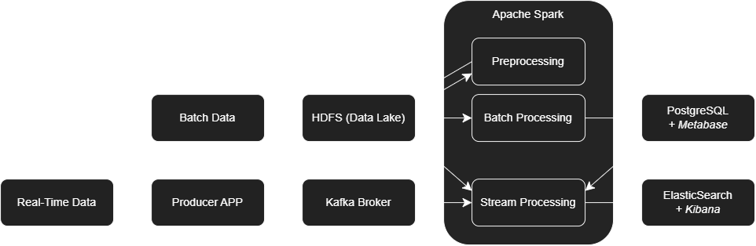

# Big data project


### 1. Prepare Data

Downloa data from following sources, rename if specified and put them in the data folder:
- Earthquakes data used for batch processing [link](https://www.kaggle.com/datasets/danielpe/earthquakes), rename to 'earthquake_data.csv'.
- Tectonic plates data used for batch processing [link](https://github.com/fraxen/tectonicplates/tree/master), download 'PB2002_plates.shp', 'PB2002_plates.dbf' and 'PB2002_plates.shx files'.
- Tsunami data used for stream processing [link](https://www.kaggle.com/datasets/andrewmvd/tsunami-dataset), rename to 'tsunami_dataset.csv'.

Before going to the next steps run the helper script to convert the shapefile to a csv with WKT geometry format, which will be used in the batch processing step:
```
python batch_processing/spark/helper_script.py
```
! NOTE current spark version is incompatible with sedona to directly load the shapefile


### 2. Arhitecture Setup

Go to the root older and run the following command to run the full pipeline:

```
./run_pipeline.sh
```
Base on the flags in the script it will run cluster_up.sh, batch_jobs_run.sh and stream_jobs_run.sh. 
- Cluster up will start the full architecture needed for both batch and stream processing, create docker networks, run containers and copy data to the hadoop datanodes.
- Batch jobs will copy the corresponding code to the spark master container and will run the preprocessing and processing script. 
- Stream jobs will copy the corresponding code to the spark master container and will run the streaming script.

If there is an error on initial setup run the following commands on all schell scripts in the project:
```
sudo apt-get install dos2unix
dos2unix run_pipeline.sh
chmod +x run_pipeline.sh
```

If you want to shut down the cluster, from the root folder run:
```
./setup/cluster_down.sh
```

Arhicecture diagram:





---

### 3. Data Upload Verification

Verify that data has been successfully copied to datanodes - http://localhost:9870/explorer.html#/user/root/data-lake

--- 

### 3. Batch Processing

Make sure that the RUN_BATCH tag in the run_pipeline.sh is set to true. If you want to run only batch processing set the other flags (RUN_SETUP, RUN_STREAM) to false.

There are 2 scripts:
- Preprocessing script - Which loads raw data from data-lake, does cleaning, plate assignment and stores it back to the transformation zone in data-lake.
- Processing script - Which loads preprocessed data from the transformation zone in data-lake, does 10 different useful queries, displays results in terminal and stores final results in PostgreSQL database.

To confirm all is working well, Spark Master UI is on http://localhost:8080. Once the app is running there is information about the current run on http://localhost:4040 .

--- 

### 4. Batch Processing Visualisation

Once the processing has finished, open http://localhost:3000/admin/databases -> Add Database -> Connection String (jdbc:postgresql://postgresql:5432/big_data)  and press 'Sync database schema'.


* If this is the first time running metabase, create an admin account and add the big_data database.

- Go to http://localhost:3000/browse/databases and choose the 'big_data', go to Visualization and visualize the tables.


### 5. Streaming Processing

Make sure that the RUN_STREAM tag in the run_pipeline.sh is set to true. If you want to run only stream processing set the other flags (RUN_SETUP, RUN_BATCH) to false.

There two major components of the streaming pipeline:
- Producer - Simulates real time data ingestion by continuosly reading records from a CSV file and publishing them to a Kafka topic.
- Consumer - Reads data from the Kafka topic in real time, parses and processes the incoming events using Spark Structured Streaming and stores the results in Elastic Search for visualization.

To verify streaming ingestion open the kafdrop UI on http://localhost:9008 and check that messages are being sent for the topic "earthquakes" -> View Messages.

---
### 6. Stream Processing Visualisation

Once the processing starts results are visible in both the terminal and stored in Elastic Search. Ensure Elastic Search service is running on http://localhost:9200/.

If all is running well, open Kibana on http://localhost:5601 to visualize the data, by opening a saved data view.

* If its your first time running Kibana go to Analytics -> Discover -> Create Data View -> Select "query_{no}" index -> Choose the Timestamp field -> Save Data View to Kibana.

* To delete index in the meanwhile, go to Dev Tools and run the following command:
```
DELETE 'index_name'
```

---

### 7. Queries List

Batch Processing:

0. *What is historical statistical summary of each tectonic based on earhtquakes (to be used for stream processing)?*

1. *How often do sonic_booms, quarry_blasts, nuclear_explosion and explosions occur each year?*

2. *What is the total number of earthquakes with magnitude over 5 for each decade grouped into ranges?*

3. *What are the maximum depths and magnitudes recorded for earthquakes in he #20th and 21th centuries, including where they occurred?*

4. *Does the change of seasons influence the frequency and intensity of earthquakes across tectonic plates?*

5. *Are stronger earthquakes statistically closer to the tectonic plate boundaries?*

6. *Does increasing number of stations reduce uncertainty in earthquake magnitude and depth estimation?*

7. *Has the accuracy and quality of seizmic measurement improved over the decades?*

8. *Which magnitute calculation method performs best for different magnitude ranges?*

9. *Which pairs of tectonic plates exhibit the highest seismic activity along their shared boundary during one random peak seismic year, most amount of earthquakes with magnitute>7? (Top 5)*

10. *How does earthquake frequency evolve around a major earhtquake (magnitude > 7) in the radius of 100km?*

Stream Processing:

1. *What is the number of tsunami events and their maximum and average intensity in 1 minute windows per tectonic plate (top 10 most active plates)?*

2. *What are the average damage cost and houses destroyed by tsunamis per region (Mediteranian, Alaskan...)?*

3. *What is the most common source of tsunami origin by country (earhtuqake, volcano, landslide...)?*

4. *What is the average magnitude and depth for an earthquake that produced tsunami per plate, enrichened with plates historical seismic activity?*

5. *Are current near-boundary tsunami events (<100km from boundary) concentrated along historically most active tectonic plate borders (aggregation with query_9)*